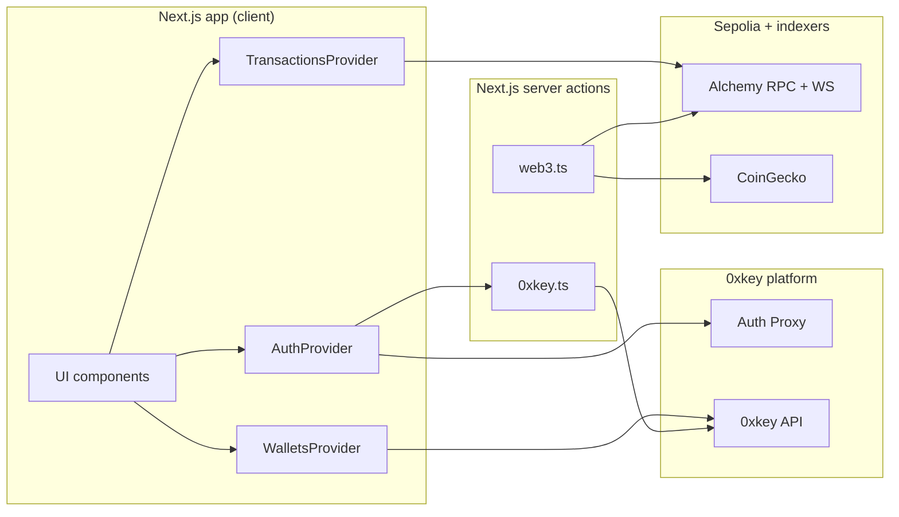
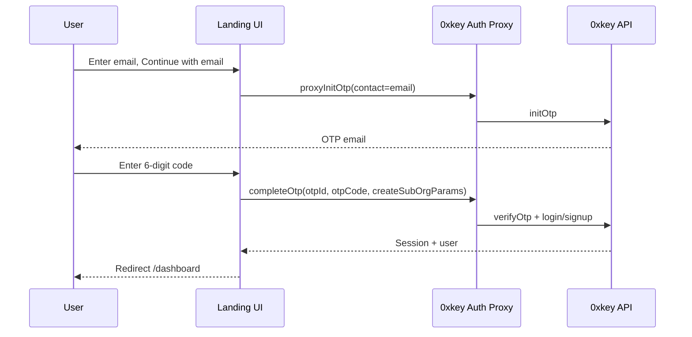
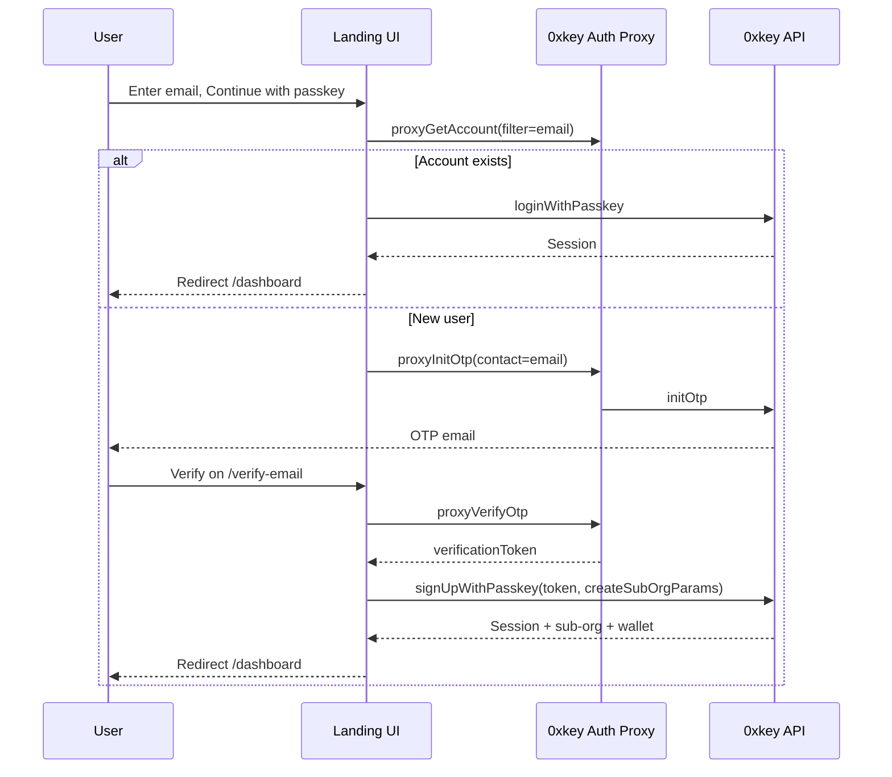
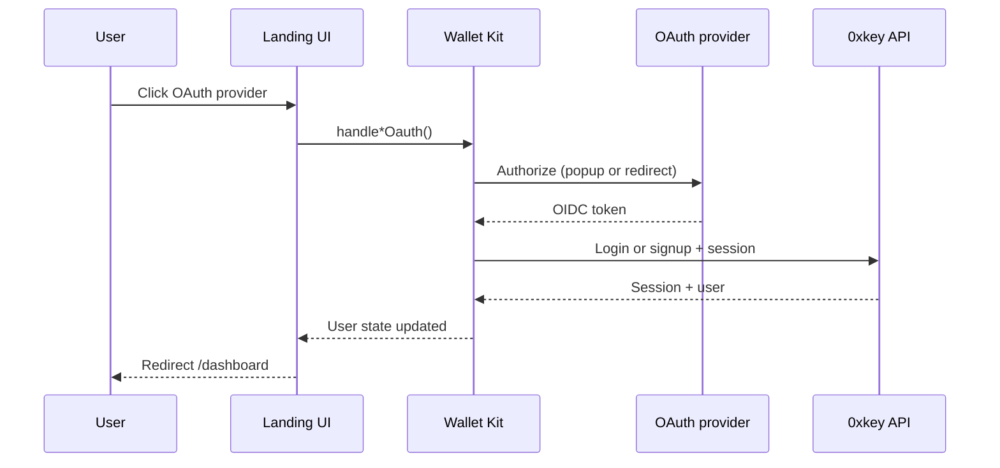
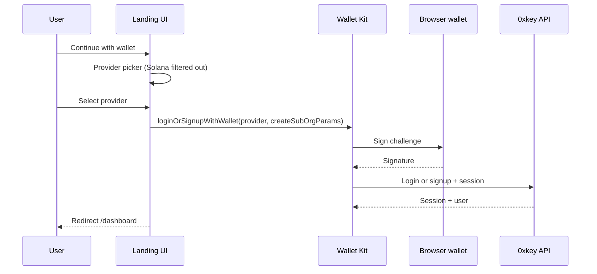
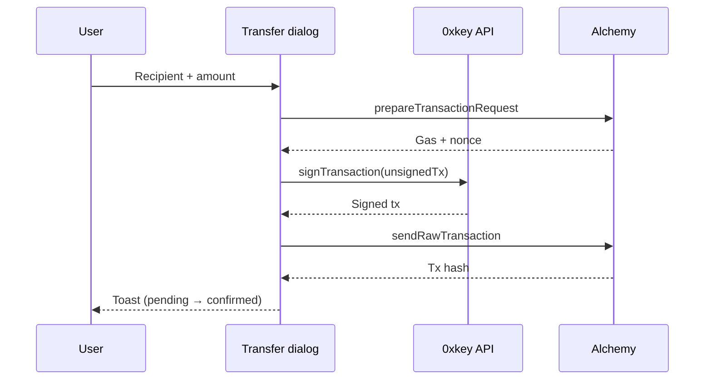
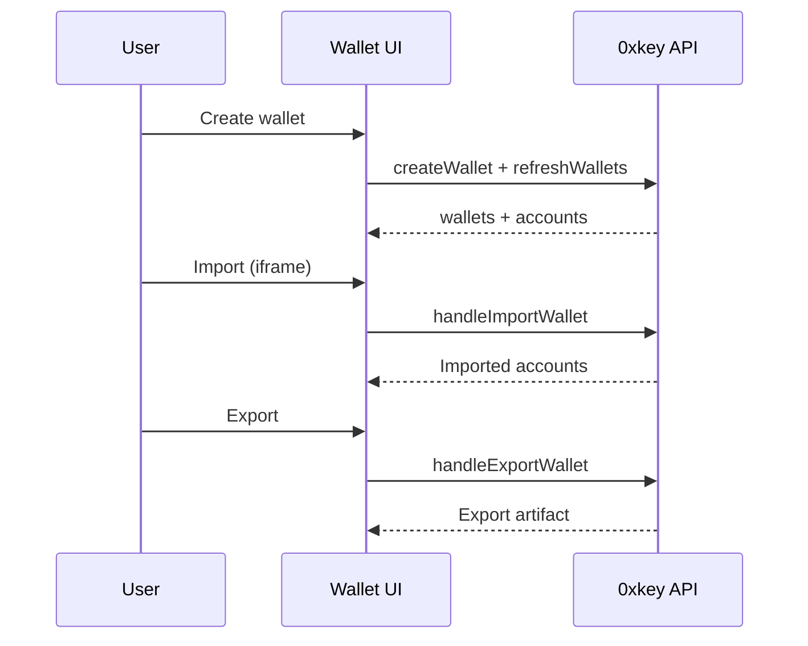

# Demo Embedded Wallet

A reference [Next.js](https://nextjs.org/) app that demonstrates an embedded Ethereum wallet on **Sepolia** using [0xkey](https://0xkey.io) and [`@0xkey-io/react-wallet-kit`](https://www.npmjs.com/package/@0xkey-io/react-wallet-kit).

Use it to explore auth, wallet management, signing, and transfers—or fork it as a starting point for your own integration.

**Stack:** Next.js 15 · React 19 · viem · Alchemy · CoinGecko · 0xkey Auth Proxy + API

## Table of Contents

- [Quickstart](#quickstart)
- [Configuration](#configuration)
- [Architecture](#architecture)
- [Auth & wallet flows](#auth--wallet-flows)
- [Features](#features)
- [0xkey integration](#0xkey-integration)
- [Troubleshooting](#troubleshooting)
- [Target network](#target-network)
- [Project structure](#project-structure)
- [Scripts](#scripts)

## Quickstart

1. **Install dependencies**

   ```bash
   pnpm install
   ```

2. **Create environment file**

   ```bash
   cp .env.example .env.local
   ```

   Fill in the values described in [Configuration](#configuration). At minimum you need 0xkey org credentials, OAuth client IDs, Alchemy, and CoinGecko keys.

3. **Run the dev server** (listens on [http://localhost:3200](http://localhost:3200))

   ```bash
   pnpm dev
   ```

> **0xkey monorepo:** From the repo root, `./local-dev.sh start-demo-embedded-wallet` starts this app on port `3200` with the local stack (Auth Proxy, API gateway, etc.). See the main repo’s local-dev docs for HTTPS subdomains such as `demo.0xkey.com`.

## Configuration

Environment variables are validated at startup by [`@t3-oss/env-nextjs`](https://env.t3.gg/) in `src/env.mjs`. Copy `.env.example` to `.env.local` and fill in your values.

For CI or local builds without credentials, set `SKIP_ENV_VALIDATION=1` (used by `pnpm build:local`).

Production defaults in `.env.example` point at **0xkey.io** (`https://api.0xkey.io`, `https://auth.0xkey.io`).

### 0xkey (required)

| Variable | Description |
| --- | --- |
| `NEXT_PUBLIC_ORGANIZATION_ID` | Parent organization ID in the 0xkey dashboard |
| `NEXT_PUBLIC_BASE_URL` | 0xkey API base URL (default `https://api.0xkey.io`) |
| `NEXT_PUBLIC_AUTH_PROXY_ID` | Auth Proxy config ID for OTP and passkey flows |
| `NEXT_PUBLIC_APP_URL` | App origin registered with OAuth providers (e.g. `http://localhost:3200`) |
| `ZEROXKEY_API_PUBLIC_KEY` | Server-side API public key |
| `ZEROXKEY_API_PRIVATE_KEY` | Server-side API private key |

### OAuth (required)

| Variable | Description |
| --- | --- |
| `NEXT_PUBLIC_GOOGLE_OAUTH_CLIENT_ID` | Google OAuth client ID |
| `NEXT_PUBLIC_APPLE_OAUTH_CLIENT_ID` | Apple OAuth client ID |
| `NEXT_PUBLIC_FACEBOOK_CLIENT_ID` | Facebook app ID |
| `NEXT_PUBLIC_FACEBOOK_AUTH_VERSION` | Facebook SDK version (e.g. `11.0`) |
| `NEXT_PUBLIC_FACEBOOK_GRAPH_API_VERSION` | Facebook Graph API version (e.g. `21.0`) |
| `FACEBOOK_SECRET_SALT` | Random string for Facebook OIDC nonce |

### Sepolia faucet (warchest)

| Variable | Description |
| --- | --- |
| `ZEROXKEY_WARCHEST_ORGANIZATION_ID` | Warchest organization ID (separate from main org) |
| `ZEROXKEY_WARCHEST_API_PUBLIC_KEY` | Warchest API public key |
| `ZEROXKEY_WARCHEST_API_PRIVATE_KEY` | Warchest API private key |
| `WARCHEST_PRIVATE_KEY_ID` | Private key ID used to sign faucet transactions |

### Web3 & pricing (required)

| Variable | Description |
| --- | --- |
| `NEXT_PUBLIC_ALCHEMY_API_KEY` | Alchemy key for Sepolia RPC, websockets, and transfers |
| `COINGECKO_API_KEY` | CoinGecko demo API key for ETH/USD price |

### Optional

| Variable | Description |
| --- | --- |
| `NEXT_PUBLIC_AUTH_PROXY_URL` | Auth Proxy base URL for `/v1/wallet_kit_config` (defaults to 0xkey production) |
| `NEXT_PUBLIC_RP_ID` | WebAuthn RP ID for passkeys (auto-detected from app URL in dev) |
| `NEXT_PUBLIC_DEFAULT_RECIPIENT_ADDRESS` | Default send recipient in the transfer dialog (locked when set) |
| `NEXT_PUBLIC_AUTH_IFRAME_URL` | Custom 0xkey auth iframe URL |
| `NEXT_PUBLIC_EXPORT_IFRAME_URL` | Custom 0xkey export iframe URL |
| `NEXT_PUBLIC_IMPORT_IFRAME_URL` | Custom 0xkey import iframe URL |

## Architecture



### Provider tree

**Root** (`src/providers/index.tsx`):

```
ThemeProvider (next-themes, forced light)
  └─ ZeroXKeyProvider (@0xkey-io/react-wallet-kit)
      └─ AuthProvider (session loading + expiry warnings)
```

**Dashboard layout** (`src/app/(dashboard)/layout.tsx`):

```
AuthGuard
  └─ WalletsProvider (wallet/account selection, balances)
      └─ NavMenu + page content
```

**Dashboard page** (`src/app/(dashboard)/dashboard/page.tsx`):

```
TransactionsProvider (history + Alchemy websocket)
  └─ WalletCard, Assets, Activity
```

`TransactionsProvider` is scoped to the dashboard page only—the settings route does not mount it.

`WalletsProvider` reads wallets from the 0xkey session via the SDK hook `useZeroXKey()`, normalizes Ethereum addresses with viem `getAddress`, and caches balances in memory.

## Auth & wallet flows

Sequence diagrams below use **0xkey API** for the main API and **Auth Proxy** for OTP orchestration. SDK method names (`ZeroXKeyProvider`, `useZeroXKey`, etc.) match the published `@0xkey-io/*` packages.

### Email OTP (Auth Proxy)

Landing UI → `/verify-email` → `completeOtp()`.



### Passkey (existing vs new user)



### OAuth (Google, Apple, X, Discord, Facebook)

Handled entirely by `@0xkey-io/react-wallet-kit` (OIDC/PKCE, sub-org creation, session). Facebook uses popup mode (`handleFacebookOauth({ openInPage: false })`); `/oauth-callback/facebook` is a legacy redirect stub.



### External wallet (MetaMask, etc.)



### Send ETH



### Create, import, export wallet



## Features

### Authentication

| Method | Implementation | Notes |
| --- | --- | --- |
| Passkey | Auth Proxy + wallet kit | Existing users log in directly; new users verify email via OTP first |
| Email OTP | `proxyInitOtp` → `/verify-email` → `completeOtp()` | Primary email flow |
| Email magic link | `/email-auth` | Legacy reference only; not used by landing UI |
| OAuth | `handleGoogleOauth`, `handleAppleOauth`, `handleXOauth`, `handleDiscordOauth`, `handleFacebookOauth` | Facebook uses popup mode |
| External wallet | `loginOrSignupWithWallet()` | Solana providers filtered out in the picker |

### Wallets & accounts

- Wallets from the 0xkey session, normalized in `wallet-provider.tsx` (valid Ethereum addresses, checksummed).
- Create wallets and accounts via wallet kit hooks (`createWallet`, `createWalletAccounts`).
- Preferred wallet stored in `localStorage` per user.
- Multi-wallet / multi-account selector; balances via viem `getBalance` with in-memory deduplication.

### Faucet (Add funds)

- Client calls `fundWallet` in `src/lib/web3.ts` → server action in `src/actions/0xkey.ts`.
- Warchest org signs and sends **0.001 ETH** on Sepolia.
- One drip per address: skipped if Alchemy already shows any incoming transfer to that address.
- Toasts link to Etherscan for pending / confirmed / error states.

### Send & receive

- Transfer dialog with Send / Receive tabs (drawer on mobile).
- Default recipient from `NEXT_PUBLIC_DEFAULT_RECIPIENT_ADDRESS` when set; otherwise user enters an address.
- viem `prepareTransactionRequest` + 0xkey-backed `WalletClient` (`@0xkey-io/viem`); review step in `send-transaction.tsx`.
- Receive tab: QR code + copyable checksummed address.

### Activity & assets

- History via Alchemy `getAssetTransfers` (sent + received).
- Live updates: `AlchemySubscription.MINED_TRANSACTIONS` on the selected account.
- 30s fetch timeout; ETH/USD from CoinGecko.

### Session & passkeys

- 15-minute session (`SESSION_EXPIRY = 900`); warning 30s before expiry (`session-expiry-warning.tsx`).
- Auto refresh via `ZeroXKeyProvider` config.
- Logout clears session, IndexedDB keys, and Google auth state.
- Settings (`/settings`): list / add / delete passkeys (cannot delete the last one).

## 0xkey integration

### Provider config

`src/config/0xkey.ts` builds `ZeroXKeyProviderConfig` for `ZeroXKeyProvider` in `src/providers/index.tsx`:

- Organization + Auth Proxy IDs
- OAuth client IDs and redirect URI (`NEXT_PUBLIC_APP_URL`)
- Sub-org params per auth method (passkey, email OTP, OAuth), each with default path `m/44'/60'/0'/0/0`
- Wallet Kit UI logos and session auto-refresh

### npm packages

Dependencies are published as `@0xkey-io/*` (currently `^0.1.1`). **SDK exports still use the `ZeroXKey*` prefix**—that is expected and not user-facing branding.

**Client**

| Package | Role |
| --- | --- |
| `@0xkey-io/react-wallet-kit` | `ZeroXKeyProvider`, `useZeroXKey()` — auth, wallets, signing, import/export |
| `@0xkey-io/core` | Shared types (`OtpType`, etc.; re-exported by wallet kit) |
| `@0xkey-io/sdk-browser` | Browser client types used in `src/lib/web3.ts` |
| `@0xkey-io/wallet-stamper` | `WalletType` for external wallet auth |
| `@0xkey-io/http` | API types in `src/types/0xkey.ts` |

**Server**

| Package | Role |
| --- | --- |
| `@0xkey-io/sdk-server` | `ZeroXKeyServerClient`, warchest faucet, server-side API calls |
| `@0xkey-io/viem` | `createAccount` — 0xkey signing as a viem `Account` |

### viem bridge

`getZeroXKeyWalletClient()` in `src/lib/web3.ts`:

1. Builds a 0xkey-backed viem `Account` via `@0xkey-io/viem`
2. Wraps it in a `WalletClient` on Sepolia (Alchemy RPC)
3. Used for user sends (browser client) and faucet (server client)

## Troubleshooting

| Issue | Symptoms | What to check |
| --- | --- | --- |
| Auth Proxy | OTP/OAuth generic failures | `NEXT_PUBLIC_AUTH_PROXY_ID`, `NEXT_PUBLIC_AUTH_PROXY_URL`, and `src/config/0xkey.ts`; hit `/v1/wallet_kit_config` on the proxy URL |
| OAuth redirect | Provider redirect errors | Redirect URIs match `NEXT_PUBLIC_APP_URL` and provider console settings |
| Passkey | `NotAllowedError`, invalid state | `NEXT_PUBLIC_RP_ID` matches deployment domain; HTTPS in production (localhost OK without custom RP ID) |
| Server actions | 401/403, invalid signature | `ZEROXKEY_API_*` and `NEXT_PUBLIC_ORGANIZATION_ID` belong to the same org (`src/actions/0xkey.ts`) |
| Faucet | “Unable to drip”, funding errors | Warchest org funded; all `ZEROXKEY_WARCHEST_*` + `WARCHEST_PRIVATE_KEY_ID` set; one drip per address |
| Alchemy / price | Zero balance, missing USD | `NEXT_PUBLIC_ALCHEMY_API_KEY`, `COINGECKO_API_KEY` |
| Facebook | Popup blocked, token errors | Facebook env vars + `FACEBOOK_SECRET_SALT`; allow popups; redirect URI includes `/oauth-callback/facebook` if using redirect mode |
| Wallet client not ready | Buttons disabled on landing | Auth Proxy reachable (local: trust Caddy CA or use `http://localhost:8082` for proxy URL) |

## Target network

**Ethereum Sepolia only.**

To switch networks, update:

- `src/lib/web3.ts` — RPC URL, `Network.ETH_SEPOLIA`, viem `sepolia` chain
- `src/actions/web3.ts` — Alchemy network
- `src/config/0xkey.ts` — account `addressFormat` / `curve` for non-EVM chains
- UI copy referencing Sepolia

## Project structure

```
src/
├── app/
│   ├── layout.tsx                 # Root layout, metadata, providers
│   ├── (landing)/                 # Public routes (InverseAuthGuard)
│   │   ├── page.tsx               # Auth landing
│   │   ├── verify-email/          # Email OTP (primary)
│   │   ├── email-auth/            # Magic link (legacy)
│   │   └── oauth-callback/        # OAuth stubs (Facebook redirect)
│   └── (dashboard)/               # Authenticated routes (AuthGuard)
│       ├── dashboard/             # Wallet, assets, activity
│       └── settings/              # Passkeys
├── actions/
│   ├── 0xkey.ts                   # Server-side 0xkey API (faucet, etc.)
│   └── web3.ts                    # Balances, history, pricing
├── components/                    # UI (auth, wallet, transfer, shadcn/ui)
├── config/
│   ├── 0xkey.ts                   # ZeroXKeyProvider config
│   └── site.ts                    # Site metadata
├── providers/                     # Theme, auth, wallets, transactions
├── lib/                           # web3, storage, utils, Facebook helpers
├── types/                         # 0xkey + web3 types
├── styles/globals.css
└── env.mjs                        # Env validation (t3-env)
```

Entry points for forking: `src/components/auth.tsx`, `src/config/0xkey.ts`, `src/providers/index.tsx`.

## Scripts

| Command | Description |
| --- | --- |
| `pnpm dev` | Dev server on port **3200** |
| `pnpm build` | Production build (validates env) |
| `pnpm build:local` | Build with `SKIP_ENV_VALIDATION=1` |
| `pnpm start` | Run production server |
| `pnpm lint` | ESLint |
| `pnpm format` | Prettier write |
| `pnpm format:check` | Prettier check |
